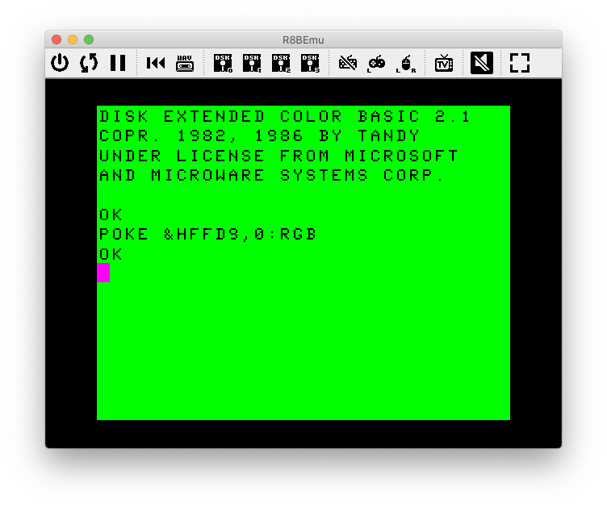

# R8BEmu : Retro 8-Bits Emulator

R8BEmu's goal is to emulate the Tandy's Color Computer family, starting with the Color Computer II but could be the
base of any other type of emulator.

## Why another emulator?
This projet emerged from nostalgia, nothing more, there is no real need for another emulator of the Color Computer.
Many of them exist and support more feature than what you'll se here. So why should I build yet another emulator?
__Just for fun!__

## Usage

    $ ./r8bemu --help
    Usage: r8bemu [options]
    
      --terminal-graphic    [true|false]    Activate the terminal interface in graphic mode
      --terminal            [true|false]    Activate the terminal interface in text mode
      --window              [true|false]    Activate the windowed graphic interface
      --disable-composite   [true|false]    Disable composite blue/red color emulation
      --home                <path>          Home directory (location of ROM files)     (default: ~/.r8bemu)
      --disk                <path>          Insert the diskette image file in drive 0  (default: ~/.r8bemu/disk.dsk)
      --playback            <path>          Define the audio file used for playback    (default: ~/.r8bemu/playback.wav)
      --recording           <path>          Define the audio file used for recording   (default: ~/.r8bemu/recording.wav)
      --script              <path>          Load a script file at boot                 (default: ~/.r8bemu/autorun.bas)
      --script-text         <text>          Type the following keys at boot
      --mouse               [true|false]    Use the mouse as the left joystick
      --dpad-left           [true|false]    Use the keyboard arrow keys as the left joystick
      --dpad-right          [true|false]    Use the keyboard arrow keys as the right joystick
      --keyboard-buffer     [true|false]    Enable keyboard input buffering
      --disassembler        [true|false]    Enable the disassembler
      --mute                [true|false]    Mute the speaker
      --help                [true|false]    Show help

### Boot ROM
In order to use this emulator, you must provide the ROM to boot on.  You can download it from an actual CoCo 2 you
own and put the content of `Color Basic` in `bas13.rom`, `Extended Color Basic` in `extbas11.rom` and
`Disk Extended Color Basic` in `disk11.rom` or craft your own :

 * __`bas13.rom`__ starting at __0xA000__ ending at __0xBFFF__, boot vector must be at __0xBFFE__ ;
 * __`extbas11.rom`__ starting at __0x8000__ ending at __0x9FFF__ .
 * __`disk11.rom`__ starting at __0xC000__ ending at __0xFF00__ .

### Scripting
In order to perform integration tests the content of a script may be is typed on the emulator keyboard.
To do so, start the application with `--script <path-to-file>`.

### Tape cassette
To load a program from a `.wav` file, start the application with `--playback <path-to-file>` and type `CLOAD` or
`CLOADM` at the prompt. To save on tape, start the application with `--recording <path-to-file>` and type
`CSAVE "<file-name>"`.

## Disk
Disk support is much faster than the cassette support as the CPU does not have to decode the data on the disk and
waits for the controller to feed sector bytes.

To load a program from a `.dsk` file, choose a disk by clicking on the disk icon and then :
 - type `DIR` to list the files,
 - type `LOAD` "<basic-file> to load a basic file,
 - type `RUN` "<basic-file> to load and run a basic file,
 - type `LOADM` "<binary-file> to load a binary file.

## Some useful resources
 - https://colorcomputerarchive.com/
 - https://nowhereman999.wordpress.com/2017/06/19/coco-6809-assembly-on-a-modern-computer/
 - https://www.maddes.net/m6809pm/
 - http://tlindner.macmess.org/?page_id=86
 - https://techheap.packetizer.com/processors/6809/6809Instructions.html

## Other emulators
 - JS Mocha : https://www.haplessgenius.com/mocha/
 - XRoaR : http://www.6809.org.uk/xroar/
