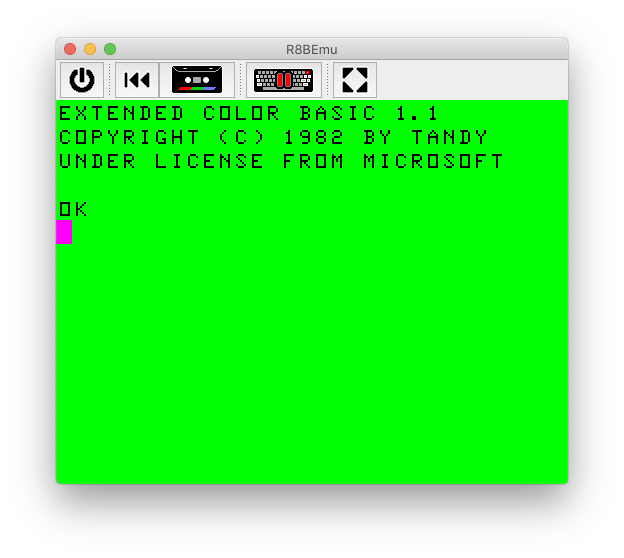

# R8BEmu : Retro 8-Bits Emulator

R8BEmu's goal is to emulate the Tandy's Color Computer family, starting with the Color Computer II but could be the
base of any other type of emulator.

## Why another emulator?
This projet emerged from nostalgia, nothing more, there is no real need for another emulator of the Color Computer.
Many of them exist and support more feature than what you'll se here. So why should I build yet another emulator?
__Just for fun!__

## Usage

    # From an ANSI compatible terminal
    ./r8bemu-terminal

    # From any desktop environment
    ./r8bemu

### Boot ROM
In order to use this emulator, you must provide the ROM to boot on.  You can download it from an actual CoCo 2 you
own and put the content of `Color Basic` in `./rom/bas.rom` and the `Extended Color Basic` in `./rom/extbas.rom` or
craft your own :

 * __`bas.rom`__ starts at __0xA000__ ending at __0xBFFF__, boot vector must be at __0xBFFE__ ;
 * __`extbas.rom`__ starts at __0x8000__ ending at __0x9FFF__ .

### Scripting
In order to perform integration tests the content of a script may be is typed on the emulator keyboard.
To do so, start the application with `--script <path-to-file>`.

### Tape cassette
To load a program from a `.wav` file, start the application with `--playback <path-to-file>` and type `CLOAD` or `CLOADM` at the prompt. To save on tape, start the application with `--recording <path-to-file>` and type `CSAVE "<file-name>"`.

## Demo!

Live action demo of a simple basic program running on the emulator.

## Some useful resources
 - https://colorcomputerarchive.com/
 - https://nowhereman999.wordpress.com/2017/06/19/coco-6809-assembly-on-a-modern-computer/
 - https://www.maddes.net/m6809pm/

## Other emulators
 - JS Mocha : https://www.haplessgenius.com/mocha/
 - XRoaR : http://www.6809.org.uk/xroar/
